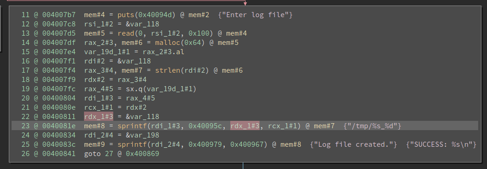
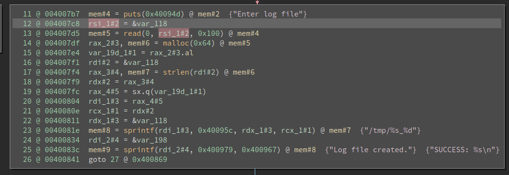

@title[Intro]
## Pattern matching bugs with binja
---

## Core idea
Not to positively identify all bugs, but guide the analyst to certain parts of the code that might contain bugs

---

```c
printf("Enter log file\n");
read(0, buf, 0x100);
path = malloc(100);
sprintf(path, "/tmp/%s_%d", buf, strlen(buf));
sprintf(result, "SUCCESS: %s\n", "Log file created.");
```

@[2](buf comes from a read)
@[3](path comes from a malloc of 100)
@[4](sprintf with _%s_ using buf into path)
@[2-4](Buffer overflow of 0x100+some in buffer of 100)

---
## Bug class

sprintf with a `%s` format string that is a non-constant parameter

---

```c
printf("Enter log file\n");
read(0, buf, 0x100);
path = malloc(100);
sprintf(path, "/tmp/%s_%d", buf, strlen(buf));
sprintf(result, "SUCCESS: %s\n", "Log file created.");
```

@[2-4](Catch this case due to non-constant %s)
@[5](Ignore this case due to constant string)

---

## Algorithm?

* Find calls to sprintf
* If the format string for sprintf doesn't contain %s, ignore it
* If the parameter associated with %s is constant, ignore it
* Slice (dafaq?) backwards on each found parameter to find where it was used

---

## Slice? Quewha?

---


---


SSA guarentees that each individual variable is assigned to only once

---


---


---
## Result?

```
sprintf("/tmp/%s_%d", X, Y)
X - var_118
    read(0, var_118, 0x100)
    strlen(var_118)
```

---

Binary Ninja

```python
# Create Binary View to access all operations
file = sys.argv[1]
bv = BinaryViewType.get_view_of_file(file)

# Get all cross references to `sprintf` calls
sprintf_addr = bv.symbols['sprintf'].address
sprintf_xrefs = bv.get_code_refs(sprintf_addr)
```
@[1-3](Get core Binary View object)
@[4-7](Get all cross references for sprintf)

---
```python
>>> print(sprintf_xrefs)
[<ref: x86_64@0x400808>, 
 <ref: x86_64@0x400826>, 
 <ref: x86_64@0x400847>]
```

---
Grab the Medium Level IL for each cross reference

```
xref.medium_level_il.ssa_form
```

Why Medium Level IL? More dataflow analysis is available than assembly or Low Level IL

---
## Filter xrefs
Ignore format strings with %s corresponding to a constant string (since we can't control it)

---
```python
for sprintf in sprintfs:
    format_str = string_from_addr(bv, sprintf.params[1].constant).replace('\n', '')
    if '%s' not in format_str:
        continue
```

@[1](For each sprintf cross reference)
@[2](Grab the format string constant from the binary: 0x40095c -> /tmp/%s_%d)
@[3-4](Ignore any format strings that don't contain %s)


---
## Find constant %s 
Filter xrefs with constant %s

```
sprintf(result, "SUCCESS: %s\n", "Log file created.");
```

---
## Format strings

Align format strings with their parameters

```python
m = re.findall('%[^%]', format_str)
for fmt, param in zip(m, sprintf.params[2:]):
    print(format_str, fmt, param.operation)
```

`sprintf.params` attribute will give the parameters to a function call

``` 
('/tmp/%s_%d', '%s', <MLIL_VAR_SSA: 80>)
('/tmp/%s_%d', '%d', <MLIL_VAR_SSA: 80>)
('SUCCESS: %s', '%s', <MLIL_CONST: 12>)
```


---
```python
m = re.findall('%[^%]', format_str)
for fmt, param in zip(m, sprintf.params[2:]):
    if fmt == '%s' and param.operation == MLIL_CONST:
        continue
```
@[3-4](Add the check to ignore constant string parameters)

---
### What do we currently have?

```c
sprintf(path, "/tmp/%s_%d", buf, strlen(buf));
```

---

The parameters for this sprintf

```
param.value
```

```json
('%s', <stack frame offset -0x118>)
('%d', <undetermined>)
```

---

```python
# Found a stack offset variable
# Find where it might have been set
if fmt == '%s' and \
    param.value.type == RegisterValueType.StackFrameOffset:
    print('[0x{:x}] sprintf({})'.format(sprintf.address, 
                                        new_format_str))

[0x40081e] sprintf(/tmp/<stack frame offset -0x118>_%d)
```

@[1-7](Make sure we have a %s corresponding to a stack variable)
@[8](Print what we currently have as the sprintf)

---
Grab location of where the stack variable was assigned

```python
definition_index = curr_func.get_ssa_var_definition(param.src) 
curr_ins = curr_func[definition_index]
```

@[1](Grab instruction index for the definition - definition_index = 22)
@[2](Extract the instruction at the retrieved index)


---
Stack Variables aren't "assigned" (per ssa)

Loop through all instrutions looking for uses of the same stack variable above the current instruction


---
```python
# Pseudocode
for block in func:
    for il in block:
        if il.src.src != wanted_variable:
            continue

        dest_var = il.dest
        uses = [curr_func.get_ssa_var_uses(dst_var) 
            if x < sprintf_instr_index]
```

@[1-3](Loop through all instructions in the current function)
@[4-5](Ignore any instruction that doesn't involve our found stack variable)
@[7-9](Grab all of the uses and retrieve their corresponding instructions )

---
Make the instrutions presentable by looking up the symbol for the function

```
0x400610 -> read
0x4005f0 -> strlen
```

---
```
[0x40081e] sprintf(/tmp/<stack frame offset -0x118>_%d)
    --------------------
    rsi_1#2 = &var_118
    mem#5 = read(0, rsi_1#2, 0x100) @ mem#3
    --------------------
    rdi#2 = &var_118
    rax_3#4, mem#7 = strlen(rdi#1) @ mem#6
    --------------------
```

@[1](var_118 is used in the sprintf)
@[2-4](var_118 was used in a read)
@[6-8](var_118 was used in a strlen)

---
The analyst now has a much smaller list of targets to look at for potential bugs
